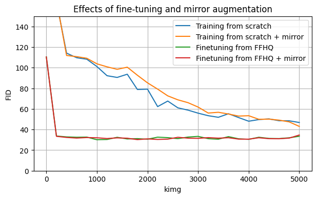
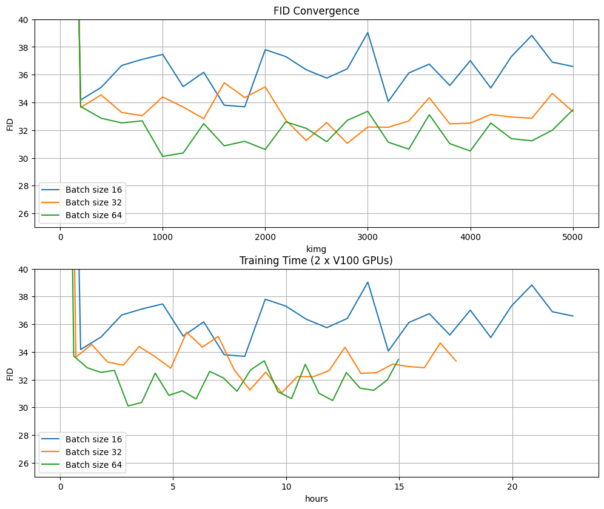
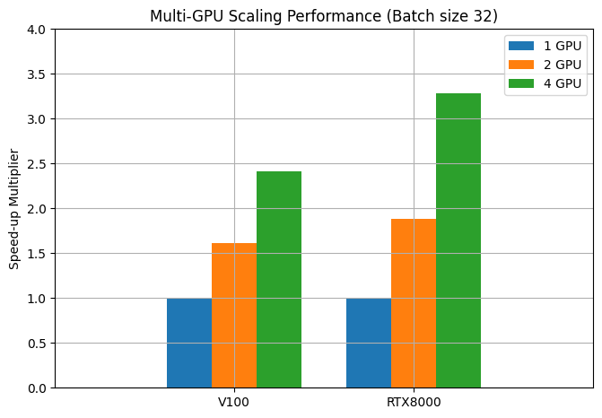

## Project Description

The objective of this project is to gain a better understanding of the inner-workings and power of GANs. Furthermore, we would like to gain a deeper understanding of the effects the adjustments of the hyperparameters can have on the overall quality/believability of the resulting images.
The overall goal of the project is to produce believable "paintings" created in the style of the Old Master portraiture artworks of pre-1800 European artists. For example, artworks by Caravaggio, Velázquez, Michelangelo, et al.

There is a tradeoff between dataset size, image size and training time. Training StyleGAN models from scratch often requires a dataset size in magnitude of ten of thousand images. Training that amount of high resolution images can take days even on multiple GPU systems. There are also challenges with data preprocessing to obtain quality images to help the model learn.

StyleGAN2 is the base GAN model that can generate high quality and diverse results. However, this model requires tens of thousands of training data. StyleGAN2-ADA is a modified version of StyleGAN2 that produces good results with only a few thousands of training images. We also consider the newest version released from NVIDIA, StyleGAN3. We plan to start training with StyleGAN2-ADA and will consider the alternatives depending on quality results and computing resources.

## Requirements

* Linux and Windows are supported, but we recommend Linux for performance and compatibility reasons.
* 1&ndash;8 high-end NVIDIA GPUs with at least 12 GB of memory. We have done all testing and development using Tesla V100 and A100 GPUs.
* 64-bit Python 3.8 and PyTorch 1.9.0 (or later). See https://pytorch.org for PyTorch install instructions.
* CUDA toolkit 11.1 or later.  (Why is a separate CUDA toolkit installation required?  See [Troubleshooting](./docs/troubleshooting.md#why-is-cuda-toolkit-installation-necessary)).
* GCC 7 or later (Linux) or Visual Studio (Windows) compilers.  Recommended GCC version depends on CUDA version, see for example [CUDA 11.4 system requirements](https://docs.nvidia.com/cuda/archive/11.4.1/cuda-installation-guide-linux/index.html#system-requirements).
* Python libraries: see [environment.yml](./environment.yml) for exact library dependencies.  You can use the following commands with Miniconda3 to create and activate your StyleGAN3 Python environment:
  - `conda env create -f environment.yml`
  - `conda activate stylegan3`
* Docker users:
  - Ensure you have correctly installed the [NVIDIA container runtime](https://docs.docker.com/config/containers/resource_constraints/#gpu).
  - Use the [provided Dockerfile](./Dockerfile) to build an image with the required library dependencies.

The code relies heavily on custom PyTorch extensions that are compiled on the fly using NVCC. On Windows, the compilation requires Microsoft Visual Studio. We recommend installing [Visual Studio Community Edition](https://visualstudio.microsoft.com/vs/) and adding it into `PATH` using `"C:\Program Files (x86)\Microsoft Visual Studio\<VERSION>\Community\VC\Auxiliary\Build\vcvars64.bat"`.

See [Troubleshooting](./docs/troubleshooting.md) for help on common installation and run-time problems.

## Code Structure

The repository is forked from the official NVIDIA implementation of StyleGAN 3 (https://github.com/NVlabs/stylegan3)

Data preprocessing is done with dataset_tool.py

The model training code is in train.py

The demo video is generated with gen_video.py

We provided example SLURM batch scripts to train on SNGFaces / MetFaces in batch_scripts folder

## Example commands

### Preparing datasets

**SNGFaces**: Download the [SNGFaces dataset](https://github.com/kondela/sngfaces-dataset) and create a zip archive using `dataset_tool.py`:

```.bash

# Scaled down 256x256 resolution.
python dataset_tool.py --source=datasets/SNG/1024 --dest=datasets/SNGFaces-256x256.zip --resolution=256x256

```

### Training

You can train new networks using `train.py`. For example:

```.bash
# Train StyleGAN2-ADA for SNGFaces from FFHQ pretrained using 2 GPUs
python train.py --outdir=training-runs --data=datasets/SNGFaces-256x256.zip --cfg=stylegan2 --gpus=2 --batch=64 \
--gamma=0.2048 --map-depth=2 --glr=0.0025 --dlr=0.0025 --cbase=16384 --kimg=5000 --mirror=1 \
--resume=pretrained/stylegan2-ffhq-256x256.pkl

```

### Video Demo

Generate video from trained network with 4x2 grid of interpolations for seeds 0 through 31

```.bash

python gen_video.py --output=lerp.mp4 --trunc=1 --seeds=0-31 --grid=4x2 \
    --network=training-runs/00012-stylegan2-SNGFaces-256x256-gpus4-batch64-gamma0.2048/network-snapshot-004435.pkl
```

### Using networks from Python

You can use pre-trained networks in your own Python code as follows:

```.python
with open('ffhq.pkl', 'rb') as f:
    G = pickle.load(f)['G_ema'].cuda()  # torch.nn.Module
z = torch.randn([1, G.z_dim]).cuda()    # latent codes
c = None                                # class labels (not used in this example)
img = G(z, c)                           # NCHW, float32, dynamic range [-1, +1], no truncation
```

The above code requires `torch_utils` and `dnnlib` to be accessible via `PYTHONPATH`. It does not need source code for the networks themselves &mdash; their class definitions are loaded from the pickle via `torch_utils.persistence`.

The pickle contains three networks. `'G'` and `'D'` are instantaneous snapshots taken during training, and `'G_ema'` represents a moving average of the generator weights over several training steps. The networks are regular instances of `torch.nn.Module`, with all of their parameters and buffers placed on the CPU at import and gradient computation disabled by default.

The generator consists of two submodules, `G.mapping` and `G.synthesis`, that can be executed separately. They also support various additional options:

```.python
w = G.mapping(z, c, truncation_psi=0.5, truncation_cutoff=8)
img = G.synthesis(w, noise_mode='const', force_fp32=True)
```

Please refer to [`gen_images.py`](./gen_images.py) for complete code example.

## Results

### Benefits of mirror augmentation and fine-tuning

<a href="./docs/configurations.png"></img></a>

- Fine-tuning has much faster FID convergence

- Pretrained model from a similar dataset (human faces) proved to be beneficial

- Mirror augmentation may help on longer training runs

### Effects of batch size on training

<a href="./docs/batch.png"></img></a>

- Training with larger batch sizes achieve better FID
- Time required to reach optimal FID is also lower with larger batch sizes

### Training time speedup of multi-GPU setup

<a href="./docs/speedup.png"></img></a>

- RTX8000 has better speed-up scaling than V100
- Training time on V100 are about 20% faster than on RTX8000


## License

Copyright &copy; 2021, NVIDIA Corporation & affiliates. All rights reserved.

This work is made available under the [Nvidia Source Code License](https://github.com/NVlabs/stylegan3/blob/main/LICENSE.txt).

## Citation

```
@inproceedings{Karras2021,
  author = {Tero Karras and Miika Aittala and Samuli Laine and Erik H\"ark\"onen and Janne Hellsten and Jaakko Lehtinen and Timo Aila},
  title = {Alias-Free Generative Adversarial Networks},
  booktitle = {Proc. NeurIPS},
  year = {2021}
}
```
